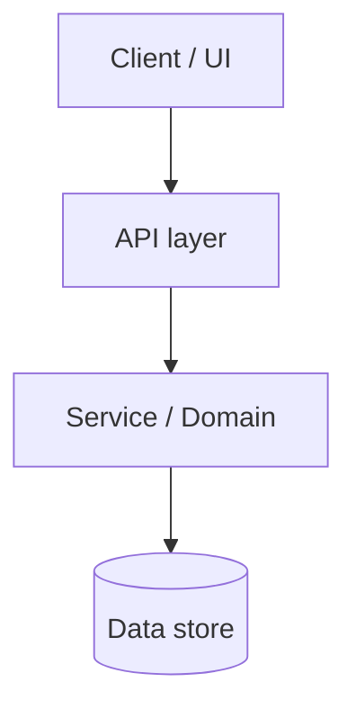
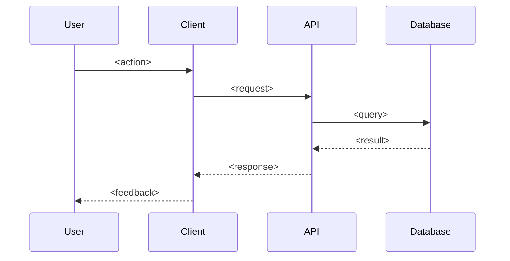
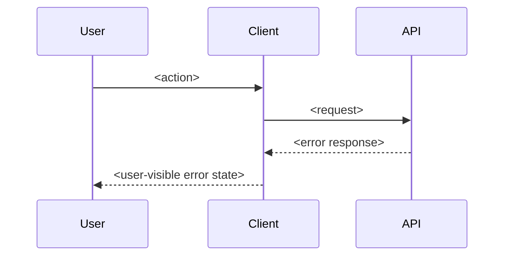

# Design — <feature-name>

status: draft
created: <YYYY-MM-DD>
last-updated: <YYYY-MM-DD>
requirements: ./requirements.md

## Overview

**Goals**

- <bullet list — what this feature must achieve>

**Non-Goals**

- <bullet list — what this feature deliberately avoids>

**Target Users**

- <primary persona(s) and their context>

## Architecture

<High-level architecture diagram in Mermaid. Show the major components and how they interact.>



## Technology Stack

| Layer       | Choice                       | Alternatives considered | Rationale |
| ----------- | ---------------------------- | ----------------------- | --------- |
| Frontend    | <e.g. Next.js 15 App Router> | <Remix, Astro>          | <why>     |
| State       | <e.g. TanStack Query>        | <SWR, Redux>            | <why>     |
| Backend     | <e.g. tRPC>                  | <REST, GraphQL>         | <why>     |
| Persistence | <e.g. Postgres + Prisma>     | <Drizzle, Kysely>       | <why>     |

## Design Decisions

### Decision 1 — <topic>

- **Context:** <what problem prompted the decision>
- **Alternatives:**
  - Option A — <pros / cons>
  - Option B — <pros / cons>
- **Choice:** <selected option>
- **Rationale:** <why this beats the alternatives>
- **Trade-offs accepted:** <what we give up>

### Decision 2 — <topic>

<repeat the structure for each major decision>

## System Flows

### Flow 1 — <happy path user action>



### Flow 2 — <error or edge-case path>



## Components & Interfaces

### `<ComponentName>`

- **Responsibility:** <one sentence>
- **Inputs:** <props / params>
- **Outputs:** <events / return values>
- **Dependencies:** <other components, services>

```ts
interface <ComponentName>Props {
  // ...
}
```

<repeat for each major component>

## Data Models

### Logical model

- **`<Entity>`** — <description>
  - `id: string`
  - `<field>: <type>` — <notes>

### Physical model

<SQL DDL, schema.prisma snippet, or storage-layer specifics. Skip this section if the feature has no persistence.>

## Error Handling

| Error class   | HTTP code | User-visible behavior       | Recovery               |
| ------------- | --------- | --------------------------- | ---------------------- |
| Validation    | 400 / 422 | <inline form error>         | <user corrects, retry> |
| Authorization | 401 / 403 | <redirect to login / toast> | <re-auth>              |
| Not found     | 404       | <empty state>               | <navigate away>        |
| Server        | 500       | <toast + Sentry capture>    | <retry with backoff>   |

## Testing Strategy

- **Unit:** <what and where>
- **Integration:** <what and where>
- **E2E (Playwright):** <critical user journeys>
- **Accessibility:** <axe pass, manual keyboard pass>
- **Performance:** <Lighthouse budgets, Web Vitals targets>

## Security Considerations

- <authn / authz model>
- <input validation / sanitization>
- <rate limiting>
- <PII / secrets handling>

## Open Questions

> Questions that do not yet have an answer. In headless mode, ambiguities land
> here instead of blocking on `AskUserQuestion`. `/spec-tasks` refuses to run
> if any entry below still has status `(open)`.

- **Q1** _(open)_ — <design-time question, e.g. "Should we use TanStack Query or SWR for cache invalidation?">
- **Q2** _(resolved: TanStack Query, already used elsewhere)_ — <previously open question kept as a decision record>
- **Q3** _(wont-fix)_ — <question deliberately left unanswered, out of scope>

<If there are no open questions, replace the bullets above with a single `- (none)` so the absence is explicit.>
